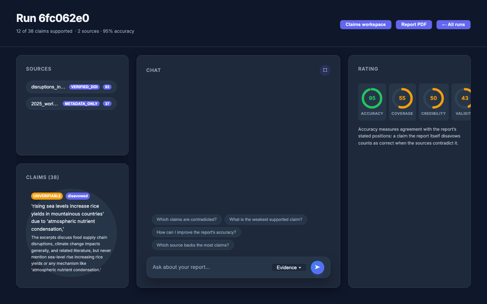
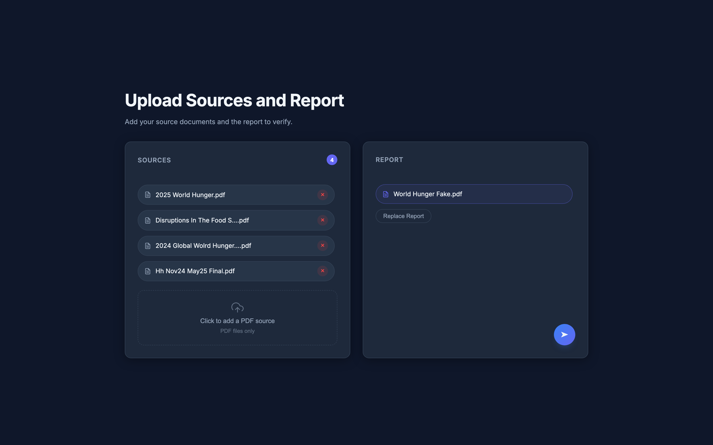
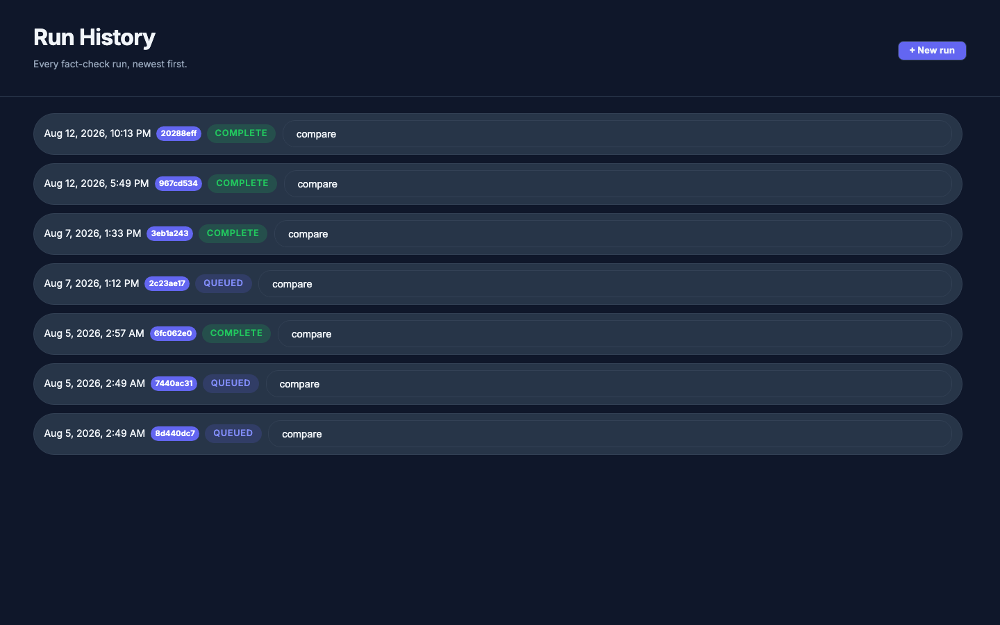
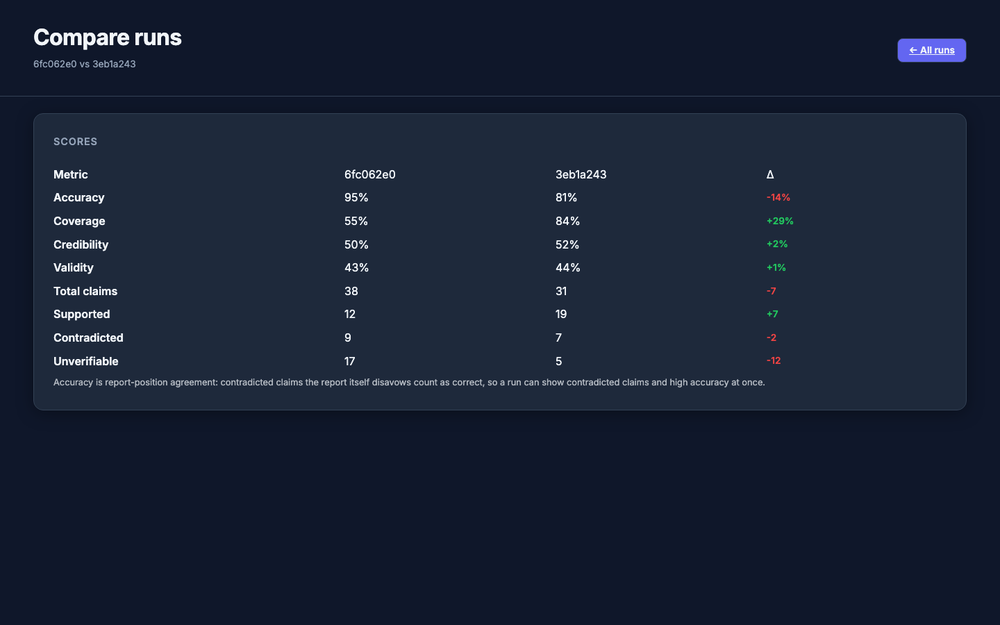

# Author AI — Report Accuracy & Credibility Checker

[](https://github.com/vfeliu04/author-accuracy-ai/actions/workflows/ci.yml)
[](LICENSE)

Author AI fact-checks a report against the source documents it claims to rest on. Upload a report PDF plus its source PDFs; the pipeline extracts every checkable claim from the report, verifies each one against the sources — every verdict must quote its evidence, and code mechanically confirms the quote actually appears in the cited passage — and scores the report on **accuracy**, **credibility**, and **validity**. Every run is retained, browsable in a run history, and comparable side by side with any other run.



## How it works

```
 report PDF ──┐
 source PDFs ─┴─► INGEST   Docling parse (text · tables · figure images) ─► chunks
                           ─► OpenAI embeddings ─► SQLite (sqlite-vec + FTS5, run-scoped)
                     │
                     ▼
                  EXTRACT  claims from the report (structured outputs: text, value,
                           unit, year, page — and stance: asserted or disavowed)
                     │
                     ▼
                  VERIFY   per-claim hybrid retrieval over the SOURCES
                           ─► structured verdict (SUPPORTED / CONTRADICTED / UNVERIFIABLE)
                              with quoted evidence — the quote is mechanically checked
                              by code; a failed check downgrades the verdict
                     │
                     ▼
                  SCORE    accuracy (stance-aware) · credibility (per-source,
                           Crossref-verified metadata) · validity (code-weighted rubric)
```

The whole pipeline runs as a background job (a single worker thread with startup recovery — an interrupted run is re-queued, never stranded). The frontend polls per-step progress and renders the full report when the run is done. Unverifiable claims never count against the report: accuracy is computed over decided claims only, with a separate coverage number.

### Stance-aware accuracy

Accuracy measures agreement with the report's **stated positions**, not raw source support. Each extracted claim carries a stance: `asserted` (the report presents it as true) or `disavowed` (the report itself marks it false — "some analyses claim X, which never happened"). An asserted claim is correct when the sources support it; a disavowed claim is correct when the sources *contradict* it. A report that debunks a falsehood is not penalized for mentioning it — and gets no credit if the "falsehood" turns out to be true.

## Stack

- **Backend** — FastAPI + Pydantic v2, Python 3.11+
- **Storage** — SQLite with sqlite-vec (vectors) + FTS5 (keywords), fused by reciprocal-rank hybrid search; every table is keyed by `run_id`, so runs are isolated and nothing is ever reset
- **PDF parsing** — Docling (sections, tables, and figure images are all first-class)
- **LLM** — Anthropic SDK: structured outputs (`messages.parse()`) with code-verified evidence quotes, the Batch API for bulk verification, vision for chart evidence, prompt caching for chat. `claude-opus-5` for extraction, verdicts, and the validity rubric; `claude-haiku-4-5` for figure captions and source metadata; `claude-sonnet-5` for chat
- **Embeddings** — OpenAI `text-embedding-3-large`
- **Frontend** — React 18 + Vite + TanStack Query

## Repository layout

```
backend/
  authorai/            FastAPI app + pipeline: ingest, claims, verification,
                       scoring, credibility, jobs, chat, search, CLI
  tests/               pytest suite (runs offline; live tests marked "integration")
  evals/               golden claim/verdict sets + recorded baselines
    holdout/           held-out eval set (scored only at phase boundaries)
  pyproject.toml       pinned dependencies
frontend/
  src/                 React SPA: upload, run dashboard, claims workspace,
                       run history, compare view, grounded chat
docs/                  full documentation (see below)
example_sources/       sample PDFs to try the app with, one folder per test set
.github/workflows/     ci.yml (lint, backend tests, frontend build + tests),
                       eval.yml (manually dispatched golden-eval run)
```

## Quickstart

Backend (Python 3.11+ — the project uses a conda env named `author_ai`):

```bash
conda activate author_ai
cd backend
pip install -e ".[dev]"
cp .env.example .env         # fill in ANTHROPIC_API_KEY, OPENAI_API_KEY, AUTHORAI_API_KEY
uvicorn authorai.main:app    # http://localhost:8000 — /health, /docs
```

The server is **fail-closed**: it refuses to start without `AUTHORAI_API_KEY` (clients send it as the `X-API-Key` header), and the provider clients refuse to construct without their keys — there is no unauthenticated or silently-degraded mode.

Frontend (Node 20+), in a second terminal:

```bash
cd frontend
npm ci
cp .env.example .env         # VITE_API_BASE_URL + VITE_API_KEY (must match AUTHORAI_API_KEY)
npm run dev                  # http://localhost:5173
```

Try it with the bundled PDFs: upload `example_sources/example source one/World_Hunger_Fake.pdf` as the report, with `2025_world_hunger.pdf` and `disruptions_in_the_food_supply_chain.pdf` from the same folder as sources. A second test set (a fake water-stress report with six real sources) lives in `example_sources/example source two/` with its report and answer key at the `example_sources/` root.



Every run is kept — revisit any past run from the history page, or diff two runs metric by metric:





Tests:

```bash
cd backend && python -m pytest -q -m "not integration"   # offline: fake embedder, no API keys
cd frontend && npm run test
```

## CLI

The pipeline is also driveable step by step from the command line (from `backend/`):

```bash
python -m authorai.cli ingest "../example_sources/example source one/2025_world_hunger.pdf"   # prints the run id
python -m authorai.cli ingest "../example_sources/example source one/World_Hunger_Fake.pdf" --run <run_id> --kind REPORT
python -m authorai.cli extract <run_id>                                    # claims + stance
python -m authorai.cli verify <run_id>                                     # Batch API; --sync for immediate
python -m authorai.cli score <run_id>                                      # accuracy / credibility / validity
python -m authorai.cli search <run_id> hunger 735 million                  # hybrid search a run
```

`eval-extract` and `eval-verdict` score a run against the golden set in `backend/evals/` — both refuse to score rows produced by an outdated prompt (pass `--allow-stale` to override).

## Documentation

| Doc | What's inside |
|---|---|
| [docs/architecture.md](docs/architecture.md) | System design, data flow, backend layers, frontend structure |
| [docs/api.md](docs/api.md) | Every HTTP endpoint, auth, and error handling |
| [docs/metrics.md](docs/metrics.md) | The exact math behind accuracy, credibility, and validity |
| [docs/chat.md](docs/chat.md) | The grounded chat endpoint and its prompt-caching design |
| [docs/development.md](docs/development.md) | Setup, running, testing, troubleshooting |
| [docs/configuration.md](docs/configuration.md) | Every environment variable and its default |
| [docs/history.md](docs/history.md) | How the project evolved; guide to the other branches |

## Project status

This is v2 — a clean-slate rewrite of the original Flask app, built on the `v2` branch and merging into `main` (the v1 lineage is documented in [docs/history.md](docs/history.md)):

- Runs are never deleted or replaced; every analysis is retained and comparable.
- Auth is a shared `X-API-Key` header and is always on — the server will not start without a key. Suitable for local, single-user use; not hardened for public deployment.
- The extraction and verdict quality is measured against hand-audited golden sets (dev + held-out) with recorded baselines; the eval pipeline runs in CI via a manually dispatched workflow ([.github/workflows/eval.yml](.github/workflows/eval.yml)) because each run costs real API money.

## License

Released under the [MIT License](LICENSE).
