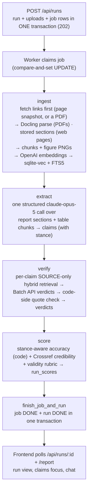

# Architecture

Author AI v2 fact-checks a **report** PDF against a set of **sources**: PDF files and web pages added by link. A FastAPI backend (`backend/authorai/`) fetches the linked pages, ingests every document, extracts the report's checkable claims, verifies each claim against the sources, and scores the report three ways (accuracy, credibility, validity). A React + Vite frontend (`frontend/`) drives uploads, shows per-run dashboards, and hosts a grounded chat. See [metrics.md](metrics.md) for what the numbers mean and [development.md](development.md) for running it.

## Design principles

- **The LLM makes language judgments; code does the math and bookkeeping.** Every LLM judgment goes through structured outputs (`messages.parse()`), and judgments that assert something (verdicts, validity assessments) must cite a verbatim quote that *code* then verifies against the text actually shown to the model.
- **Every table is run-scoped.** Each pipeline table carries a `run_id`; runs never overwrite each other and there is no reset step, ever. (v1 wiped the world on every run.)
- **Failures are loud, never silent fallbacks.** No API key ⇒ the process refuses to start. A missing figure image ⇒ the judge call raises instead of degrading to text. Malformed config weights ⇒ error, not defaults. Partial batch results ⇒ nothing is stored.
- **Accuracy is reported three ways** — supported / contradicted / unverifiable — and the headline number never counts "we couldn't check it" as "wrong".

## Pipeline

One upload creates one run, one job, and four resumable steps executed by a single background worker:



Each step is recorded in the job's `progress` JSON (`{step, label, status, ts}`, upserted by step name). A restart re-queues any `RUNNING` job and resumes from its first incomplete step — see [Jobs](#jobs-jobspy).

## Backend modules (`backend/authorai/`)

| Module | Role |
| --- | --- |
| `db.py` | SQLite schema, migrations, and all repository functions |
| `ingest.py` | Docling PDF parsing and stored web-page snapshots → one `ingest_parsed` write path → chunks + embeddings |
| `fetch.py` | Fetching source links: URL checks, the private-address gate, IP pinning, manual redirects, size and time caps |
| `web.py` | Web-page extraction: readable article text as sections (trafilatura) plus the metadata the page's markup declares, read in a separate process under a time limit |
| `chunking.py` | Plain-code paragraph packing (1200 chars, 200 overlap) |
| `embeddings.py` | OpenAI embeddings (`text-embedding-3-large`, dim 3072); `FakeEmbedder` for tests |
| `search.py` | Hybrid search: sqlite-vec KNN + FTS5 BM25, fused with RRF |
| `claims.py` | Claim extraction (structured LLM call, stance-aware) |
| `verification.py` | Evidence retrieval, verdict judging, code-side quote verification |
| `credibility.py` | Source metadata extraction, Crossref verification tiers, credibility scoring |
| `scoring.py` | Stance-aware accuracy (pure code), validity rubric, `score_run` orchestration |
| `jobs.py` | Jobs worker: one thread, resumable steps, startup recovery |
| `api.py` | Authenticated HTTP API + pure-ASGI auth/size middleware |
| `chat.py` | Grounded chat over a DONE run (prompt-cached context) |
| `llm.py` | The one Anthropic client — all LLM traffic, sync + batch + vision + chat |
| `evals.py` | Golden-set scorers (extraction recall/precision, verdict accuracy, stance) |
| `config.py` | Pydantic settings from env / `backend/.env` (prefix `AUTHORAI_`) |
| `cli.py` | `python -m authorai.cli ingest/extract/eval-extract/verify/eval-verdict/score/search` |
| `main.py` | App factory: fail-closed startup, worker lifecycle, CORS |

## Storage (`db.py`)

One SQLite file (`AUTHORAI_DB_PATH`, default `data/authorai.db`) holds everything: relational tables, the FTS5 keyword index, and the sqlite-vec vector index. Connections run WAL with `busy_timeout=5000` (set *before* the WAL switch so racing openers wait instead of throwing `SQLITE_BUSY`) and `foreign_keys=ON`.

**Migrations** run at connect time via `PRAGMA user_version`; `SCHEMA_VERSION` is currently **12**. Each migration is an `if version < N:` block whose DDL, data moves, and version bump execute in one `BEGIN…COMMIT` script, so an interruption can never leave a half-created schema. Two loud guards at open:

- A database with `user_version > SCHEMA_VERSION` (written by a newer build) **refuses to open** — an old checkout writing through a schema it doesn't understand would corrupt silently.
- A database created with a different `embedding_dim` than configured refuses to open — mixed dimensions would corrupt every similarity search.

| Table | Contents |
| --- | --- |
| `meta` | Key/value; stores the database's `embedding_dim` |
| `runs` | `id, created_at, status (CREATED/RUNNING/DONE/FAILED), error` |
| `uploads` | One row per submitted report or source: kind, `source_type`, original file name (for a link, the link), server-side path (the PDF, or a web page's JSON snapshot), `url` (the origin link; NULL for uploaded files), `content_hash` (SHA-256, indexed — NULL on legacy/CLI rows and on web pages) |
| `documents` | One row per ingested document: `run_id`, kind (`SOURCE`/`REPORT`), title, metadata JSON (its sections; a web page's also carries its fetch `provenance`), `embedding_model` (which model made its vectors — the dedup donor filter) |
| `chunks` | Retrieval units: `run_id`, `doc_id`, page (the PDF locator), section (its heading — the web-page locator), kind (`text`/`table`/`figure`), text, `figure_id`, `start_seconds`/`end_seconds` (a time locator; NULL on PDF and web-page chunks) |
| `chunks_fts` | FTS5 index over chunk text (external-content table, trigger-synced) |
| `chunks_vec` | sqlite-vec `vec0` index: `run_id` **and** `doc_kind` are PARTITION KEYs |
| `figures` | Extracted figure PNGs: image path, caption, LLM description |
| `claims` | Extracted claims: text, value, unit, year, subject, **`stance`** (`asserted`/`disavowed`), `extraction_prompt_hash` |
| `verdicts` | One per claim (`claim_id UNIQUE`, `ON DELETE CASCADE`): verdict, `raw_verdict`, quote, `quote_verified`, `quoted_chunk_id`, evidence chunk ids, `year_flag`, rationale, model, `prompt_hash` |
| `run_scores` | The run's three scores as JSON (accuracy, credibility, validity) |
| `source_credibility` | Per-source metadata, component scores, total, tier |
| `jobs` | Pipeline jobs: status, payload (upload ids), progress JSON, error |

Migration 12 added `uploads.source_type` (`NOT NULL DEFAULT 'pdf'`, which describes every earlier row truthfully), `uploads.url`, and `chunks.start_seconds`/`end_seconds`. The source-type vocabulary is `pdf`, `web`, `image`, `youtube`, checked in code by every writer (`check_source_type`) rather than by an SQL CHECK, which SQLite could never widen later. Uploads and link fetches create only `pdf` and `web` rows.

Index-invariants enforced in SQL:

- **Chunk text is immutable** — a `BEFORE UPDATE OF text` trigger aborts, because an in-place edit would desync the stored embedding. Delete and re-add instead.
- FTS5 stays in sync via `AFTER INSERT` / `AFTER DELETE` triggers; the delete trigger also removes the row's vector from `chunks_vec`.
- Embeddings are L2-normalized on write, so vector distance ordering equals cosine ordering.

## Hybrid search (`search.py`)

Vector search is good at paraphrase and bad at exact numbers; keyword search is the reverse. Both channels fetch up to `max(k, 20)` candidates, then Reciprocal Rank Fusion (`score = Σ 1/(60 + rank)`, rank 1-based) merges them so a chunk found by both outranks single-channel hits.

- **Vector channel**: sqlite-vec KNN, scoped by the `run_id` (and optionally `doc_kind`) PARTITION KEYs — index-native filtering, no over-fetch, no post-filter.
- **Keyword channel**: FTS5/BM25; each query token is quoted (user text can't break FTS5 syntax) and tokens are **OR**-joined — claim-length queries under implicit AND would return nothing.

Every query is scoped to one run via SQL. Verification passes `doc_kind="SOURCE"` so a report can never be its own evidence.

## Ingestion (`ingest.py`, `web.py`, `chunking.py`)

Every document becomes a `ParsedDocument` (sections, tables, figures) and is written by one function, `ingest_parsed`. Two readers produce it:

- **PDFs** — `parse_pdf` is the only function that touches Docling (digital PDFs only — `do_ocr=False` is a deliberate flag, not a gap; `images_scale=2.0`, picture images generated). It yields sections, tables (exported to Markdown + caption), and figures (PIL images + caption).
- **Web pages** — `load_snapshot` reads back the sections `extract_web` produced when the page was fetched ([below](#web-pages-webpy)). A page yields sections only: its tables stay inline in the section text as Markdown, and it has no figures.

Downstream:

- **Text** chunks: paragraphs packed greedily to 1200 chars with 200-char overlap; a chunk never splices non-adjacent passages (**document-order invariant** — chunk text is quoted as evidence downstream). A chunk keeps its section's page and heading; a web-page chunk has no page, so its heading (`chunks.section`) is its locator.
- **Table** chunks: caption + Markdown, capped at 4000 chars.
- **Figure** chunks: caption plus an LLM-written description (`claude-haiku-4-5`), baked into the chunk text *before* embedding — chunk text is immutable, so this is the only moment it can happen. The PNG is saved under `figures_dir/<run_id>/<doc_id>/`.

All failure-prone external work (parsing, figure descriptions, the embedding call) happens **before** any database or filesystem write, so a failed ingest leaves no half-ingested document. An empty parse raises instead of indexing an empty document.

**Cross-run ingest dedup.** Whoever stores a PDF's bytes records their SHA-256 in `uploads.content_hash`: the API for an uploaded file, the worker for a PDF fetched from a link. Before ingesting fresh, the worker looks for the newest **complete** document (one that has chunks) whose upload shares the hash **and whose `documents.embedding_model` matches the configured model** — the stamp is per document (not a global setting), so vectors made under another model can never answer for this one, and unstamped pre-dedup documents simply never donate. The donor's derived data is **copied** into the new run: the document row, figures (PNGs copied on disk first, so no row ever points at a missing file), chunks, and the raw embedding blobs byte-for-byte — never re-embedded, since renormalization isn't float32-stable. **Copy, never share**: the two runs reference no common row or file afterwards, so deleting either run leaves the other whole. The copy lands under the *new* upload's kind (a SOURCE donor can serve a REPORT upload — `chunks_vec.doc_kind` is rewritten), and a donor title that was the filename-stem fallback is retitled with the new upload's stem, exactly as a fresh ingest would title it. Hashless uploads (legacy rows, the CLI path, web pages) always ingest fresh, and so does any upload whose **copy fails** (donor deleted mid-copy, a donor PNG lost from disk): dedup is an optimization, so a failed copy cleans up after itself and falls through to recomputing rather than failing the run. A fully reused ingest constructs no provider client at all; the step label reports it as `Read N documents (M already read)`.

### Web pages (`web.py`)

`extract_web` makes two independent readings of one fetched page: its readable text, and the metadata its own markup declares.

**Body.** The page is parsed once and edited before trafilatura (pinned at 2.2.0) extracts its main content, leaving out site chrome such as navigation and footers:

- consent banners (`cookie` or `consent` in an id or class, but never on, inside, or around the `<article>` or `<main>`), modal dialogs (`role="dialog"`, `role="alertdialog"`, or `aria-modal="true"`, unless they hold the article), and paywall prompts (`paywall` in an id or class, under 1000 characters, and worded as a subscription offer) are pruned;
- comments, images, and links are not extracted;
- emphasis tags are unwrapped, so chunk text quoted as evidence carries no Markdown emphasis markers;
- a `<sup>` or `<sub>` holding only digits and signs becomes plain text (`10<sup>6</sup>` → `10^6`, `CO<sub>2</sub>` → `CO2`), a `<sup>` holding a link (a footnote marker) is removed, and any other is unwrapped;
- a table nested in a table is flattened into its cell (cells joined by `, `, rows by `; `);
- a numeric character reference to a control character XML forbids (`&#12;`, or Word's `&#11;`) is read as a space, so it can neither make the edits fail nor get the page discarded as thin (the metadata reading below is unaffected).

trafilatura runs in fast mode, and its full extraction cascade runs only when fast mode finds the page thin. Sections are split at the heading elements of the extracted tree, never by parsing Markdown; content before the first heading gets an empty title, and empty sections are dropped. Each section is written with trafilatura's own Markdown writer, so tables stay inline as pipe tables. Fewer than `MIN_BODY_CHARS` (250) characters of section text — headings not counted — raises `ThinPageError` naming the URL: `<url> has no readable article text (<n> characters extracted, at least 250 needed) — JavaScript-only pages are not supported`. The document's title is the declared title, else the first heading.

**Metadata.** Read with the stdlib HTML parser from the page's own markup: `<meta>` tags and `<title>` before `<body>` (a page with no `<body>` tag is read whole), and JSON-LD anywhere. The first non-empty value wins:

| Field | Precedence |
| --- | --- |
| title | `citation_title` > JSON-LD `headline` > JSON-LD `name` > `og:title` > `<title>` |
| authors | `citation_author` (all) > JSON-LD personal author names > `author` meta (one, unless the page declares that name as an organization: a JSON-LD Organization author, a JSON-LD publisher not typed `Person`, `citation_publisher`, or `og:site_name`, compared case-insensitively) |
| publisher | `citation_publisher` > JSON-LD `publisher` name > `og:site_name` > JSON-LD Organization author name |
| publication date | `citation_publication_date` > `citation_date` > JSON-LD `datePublished` > `article:published_time` |
| DOI | `citation_doi` > JSON-LD `identifier` or `sameAs` DOI |

Every JSON-LD value comes from one node, the page's own work, except that an author or publisher that node gives only as an `@id` reference is resolved within the page's graph. That node is, among article-type nodes (`Article`, `NewsArticle`, `BlogPosting`, `Report`, `ScholarlyArticle`), the one whose `url`, `@id`, or `mainEntityOfPage` names this URL, or the only article-type node there is. When there are several and none of them, or more than one, names this URL, no node is used and every field falls back to the `<meta>` tags: document order is no evidence of which node is the page's own. The exception is nodes that declare the same work — the ones naming this URL, or all of them when none does, with the same title, authors, publisher, publication date, and DOIs, as when a CMS and a theme plugin each emit the page's `Article` — which are one work, not an ambiguity, so the first of them is used. Page-type nodes (`WebPage` and its subtypes) get the same choice, and only when there is no article node. A page can embed records of other works — the study a news story reports on — whose authors and DOI are not the page's. URLs are compared without their scheme, a leading `www.`, host case, the fragment, a trailing slash, and tracking query parameters (`utm_…`, `fbclid`, `gclid`, `mc_cid`, `mc_eid`); any other query parameter is part of the address. Both sides are spelled as the fetched URL is — an international host in punycode, the path's non-ASCII characters percent-encoded, and every escape in upper case (an existing escape is never decoded, so `%2F` stays distinct from `/`) — since a CMS may write its own URL decoded or with lower-case escapes. A winning DOI that fails validation becomes null rather than falling through. Dates normalize to ISO (`YYYY-MM-DD`, `YYYY-MM`, or `YYYY`) when they parse and stay as printed otherwise, and `scholarly` is true when the page carries any `citation_*` tag. A malformed JSON-LD block is skipped with a warning naming the page.

Metadata is never taken from trafilatura's own metadata (its site name can be derived from the hostname, and its date search is heuristic), never from the hostname (publisher authority matches whole words, so `united-nations-fan-club.org` would match `United Nations` on the tier-1 list), and never from body text (reference lists describe other works).

### Links in the ingest step (`jobs.py`)

`POST /api/runs` checks a link's syntax and records it as an upload with `source_type='web'`, the normalized link as both `url` and `file_name`, no `content_hash`, and a **planned** path, `uploads_dir/<id>.json`. The request fetches nothing.

The ingest step begins with a **fetch pass**: each link upload whose page is not stored yet (or whose stored page will not load, below) is fetched ([Fetching links](#fetching-links-fetchpy)), one at a time in the order the links were added, before any document is processed, so a link that cannot be read fails the run in seconds — before the report's Docling parse, figure captions, or embeddings run. The pass stops at the first link that fails; links after it are not fetched until the retry. What the link serves decides what is stored:

- **A web page** is read by `extract_web`, in a separate process under a time limit (**Reading time limit**, below), and written to the planned path as a **snapshot**, atomically (a `.part` file, then `os.replace`) and with sorted keys, so its bytes depend only on its content.
- **A PDF** is written beside it as `<id>.pdf` (the same `.part`, then rename), and one update (`record_fetch`) records the path, `source_type='pdf'`, and the SHA-256 `content_hash`. From then on it is an uploaded PDF in every respect — Docling parse, figure captions, and dedup by its bytes — and `url` still records the link.

A snapshot (shown indented), which is also what the file endpoint serves for a web page:

```json
{
  "document": {
    "sections": [{ "page": null, "text": "…", "title": "Key facts" }],
    "title": "…"
  },
  "provenance": {
    "authors": [], "content_type": "text/html", "doi": null, "fetched_at": "…",
    "final_url": "…", "publication_date": "…", "publisher": "…", "scholarly": false,
    "title": "…", "url": "…"
  },
  "schema": 1
}
```

`provenance` records the link as normalized at upload (`url`), where it ended up after redirects (`final_url`), when it was fetched, the served media type, and the page's declared metadata. `load_snapshot` refuses any schema other than 1 and any malformed file, and the frontend refuses an unknown schema too. Ingesting a snapshot copies its `provenance` into `documents.metadata`, where credibility scoring reads it.

Files are written before the row changes, so a crash leaves at most an orphan file, never a row pointing at nothing. Every file a link can leave shares its planned path's server-generated name: `<id>.json`, `<id>.pdf`, and the `.part` of either. Once a fetch has stored its file and the row names it, the others are removed — a PDF stored but never recorded, a page the link no longer serves, a `.part` never renamed — and deleting the run removes all of them. A stored page that loads is never fetched again: a retry or startup recovery skips it, and a torn page ingest re-ingests from its snapshot. A stored page that will not load (cut short by a power loss, or written under an older snapshot schema) is deleted and fetched again, since every retry would otherwise fail on it identically — unless a finished document (one with chunks) was already made from it, in which case it stays as stored. A link that served a PDF is a `pdf` upload from then on and is never fetched again. Pages are not hashed, so a page never reuses, or donates to, another run's ingest.

**Reading time limit.** The ingest step reads a fetched page with `extract_web_bounded`, which runs `extract_web` in a freshly spawned child process (spawned, never forked: the caller is the worker thread) and stops it after `extract_timeout_seconds` (60) of wall clock. trafilatura's own cleaning can go quadratic on markup that fits under the 10,000,000-byte body cap, and nothing else could interrupt the single worker thread. The page reaches the child through a private temporary file, removed on every path, never as a process argument: spawn writes arguments to the child over a pipe, so a page larger than the pipe buffer would hold `start()` until the child read it — forever if the child died first. Starting the child therefore never waits on it, and the deadline covers the child's start-up as well as its reading. At the deadline the child is terminated, then killed, and the step fails with `ExtractionTimeoutError: <url> took longer than 60 seconds to read (the page is too large or complex)`. A `ThinPageError` or `ValueError` raised in the child is raised again as that type with the same message; any other failure in the child, a child that exits without a result (killed, out of memory), or a page that cannot be written for the child fails the step with a `RuntimeError` naming the URL (`<url> could not be read: …`). The run's error stays short: the traceback of a failure the child reported (other than a thin page), or the exit status of a child that reported nothing, goes to the server log. The child's life is tied to the server's:

- It is started with `SIGINT` blocked. A terminal Ctrl-C signals the server's whole process group, the child included; a child killed by it would report nothing, and the run would be recorded `FAILED` blaming the link. Instead the server stops with the run still `RUNNING`, and startup recovery resumes it.
- A watcher thread in the child ends it the moment the server process is gone. A server killed outright or crashed runs no exit hook to stop the child, which would otherwise read on beside the one startup recovery starts.
- A CPU-time limit of the budget, rounded up, plus 5 seconds (never loosening a stricter limit the child inherited) ends a child the watcher cannot reach, such as one inside a long C call that holds the GIL. The child reads on one thread, so its CPU time never exceeds its wall-clock time, and while the server lives the deadline always comes first.

Starting the child costs about half a second per page, inside the budget. A link that serves a PDF is not read this way: it goes to Docling like an uploaded PDF.

**Decoding.** When the fetched body is not valid UTF-8, does not start with a byte-order mark (UTF-8 or UTF-16), and the HTTP `Content-Type` names a text encoding, the ingest step decodes the body with that charset (`iso-8859-1` and `ascii` as windows-1252, as browsers do). A label Python does not know, one that names no text encoding (`base64`, `bz2_codec`), or a codec that refuses every byte (`undefined`) is ignored, and so is the header whenever the body starts with a byte-order mark. Otherwise `extract_web` decodes the bytes itself: a UTF-16 or UTF-8 byte-order mark first, over any `<meta>` charset as well as the header (a sequence the marked encoding cannot decode becomes U+FFFD, with a warning in the server log, rather than sending the whole page to another encoding), then UTF-8 whenever the bytes are valid UTF-8, then a `<meta>` charset declared in the first 4096 bytes (ISO-8859-1 and ASCII labels as windows-1252, a UTF-16 label as UTF-8; a label that is unknown, names no text encoding, or refuses every byte fails as `<url> declares an unknown charset '<label>'`). Bytes that fit none of these fail loudly, naming the URL — a guessed encoding would corrupt text that is later quoted as evidence.

**Failures name the link.** A `FetchError` (blocked address, DNS failure, HTTP error status, unsupported content type or content encoding, a response over its cap, timed out, too many redirects), a `ThinPageError`, the `ValueError` for bytes that cannot be decoded, an `ExtractionTimeoutError`, or the `RuntimeError` for a reader that failed any other way fails the step, and the run's error, `<ExceptionType>: <message>`, names the link as added. A fetch error that fails at a redirect target names both addresses: `'<target>' (redirected from '<link>')`. Reading the page sees only where the link ended up, so when the link redirected, the ingest step raises a reading error again as the same type with both addresses in front of the reader's own message: `'<final>' (redirected from '<link>'): <message>`. The frontend marks a source row only when the error names that row's link as added — whole, or cut short where the message shortened a long link, and spelled either as added or with each backslash doubled, as the message's quoting writes a link that holds one — and its failure hints still match the reader's original wording. Without a redirect, the reader's message names the link as added already and is left unchanged. The retry endpoint re-runs the step, fetching only what is still missing. A `youtube` upload fails the pass with `ValueError: YouTube sources are not supported yet: '<url>'`; the API refuses YouTube links before such a row can exist. Only the link itself is checked against YouTube's hosts, so a link that redirects to YouTube is fetched like any other page. The step label, shown under the finished step, adds each count only when it is non-zero: `Read N documents`, `Read N documents (F links opened)`, `Read N documents (M already read)`, or `Read N documents (F links opened, M already read)`, singular as `1 link opened`. F counts the links this attempt fetched, whether they served a page or a PDF; M counts the documents copied from another run's ingest.

## Fetching links (`fetch.py`)

A web-page source is a URL the user supplies, and the worker fetches it. On a public repo that is a server-side request forgery surface: a URL, a redirect, or a DNS answer could otherwise aim the server at loopback, a cloud metadata endpoint, or the rest of its private network. `fetch_url` is the only way the pipeline reads a link, and a fetch meets its defenses in this order:

1. **URL check** (`validate_source_url`, which the API also runs before anything is stored): after trimming whitespace, `http` or `https` only; a host made of hostname characters, or an IPv6 literal without a zone ID; a valid port; no username or password; at most 2048 characters as given and once encoded. The fragment is dropped, and httpx normalizes the rest (lowercase scheme and host, IDNA-encoded host, percent-encoded path). Every redirect target is checked the same way.
2. **Address gate**: the host is resolved, and **every** answer must be a public address — `is_global` and not multicast, never in carrier-grade NAT `100.64.0.0/10`, local-use NAT64 `64:ff9b:1::/48`, IPv4-compatible `::/96`, deprecated site-local `fec0::/10`, SIIT IPv4-translated `::ffff:0:0:0/96` (blocked outright, not unwrapped), or SRv6 segment identifiers `5f00::/16` — the stdlib calls several of these global — and no IPv6 zone. IPv4 carried inside IPv6 (IPv4-mapped, NAT64, 6to4, Teredo) is unwrapped and must pass too; the stdlib calls `64:ff9b::7f00:1`, NAT64 of loopback, global. One non-public answer blocks the host with `BlockedAddressError`. The offending addresses go to the server log only, so the error cannot be used to map an internal network one URL at a time.
3. **IP pinning**: the request goes to the first vetted address as an IP literal, with the hostname in the `Host` header and, for https, in the TLS SNI (httpx's `sni_hostname` extension). Certificate verification still runs against the hostname, and the HTTP client never makes a second DNS lookup that a rebinding server could answer differently. Each hop opens a fresh connection (`Connection: close`), and the client is built with `trust_env=False` — an environment proxy would resolve the host itself, voiding both the gate and the pin.
4. **Manual redirects**: 301, 302, 303, 307, and 308 are followed by hand, at most `fetch_max_redirects` (5) hops, each one re-checked, re-resolved, re-gated, and re-pinned.
5. **Response gates**, before the body is read: a 2xx status; a `Content-Type` of `text/html` or `application/xhtml+xml` (capped at `fetch_max_bytes`, 10,000,000 bytes) or `application/pdf` or `application/octet-stream` (capped at `max_upload_bytes`, 50,000,000 bytes), any other type refused; a `Content-Encoding` of `gzip`, `deflate`, or `identity` only (httpx passes a coding it cannot decode through untouched), and a **single** coding layer — stacked codings such as `gzip, gzip`, in one header or across repeated `Content-Encoding` headers (httpx joins the values; `identity` and empty tokens are not counted as layers, so `gzip` in one header and `identity` in another is a single layer, accepted), are refused with `unsupported stacked Content-Encoding '<codings>'` (the counted layers, at most four quoted, then `...`), because httpx inflates every layer of a socket read before the cap sees it; a declared `Content-Length` over the cap refused. The body then streams against the cap in **decoded** bytes, so a compression bomb is measured after inflation: with one layer, a single 64 KiB socket read inflates to at most about 66 MB before the check sees it. A body that starts with `%PDF-` is a PDF; a PDF-typed response whose body does not is refused.
6. **One time budget**: `fetch_timeout_seconds` (30) covers the whole fetch, every hop included. It is checked between hops and after each body chunk, each request's socket timeouts are capped at what remains, and a watchdog timer shuts the connection's socket when the budget runs out — a server trickling header bytes just faster than the read timeout would otherwise hold the single jobs worker indefinitely. Once the watchdog has fired, the fetch fails as timed out even when the body read ended without an error: a body framed by connection close (no `Content-Length`, not chunked) ends when its socket does, so a page cut short by the watchdog would otherwise read as complete. A body cut by the time budget is never returned or stored. The one wait the budget cannot interrupt is the operating system's DNS lookup, which the OS resolver bounds.

Requests identify themselves with `fetch_user_agent`. Every failure is a `FetchError` whose message names the URL, with credentials removed and long URLs cut at 200 characters.

## LLM layer (`llm.py`, `config.py`)

All Anthropic traffic goes through one client. It refuses to construct without `ANTHROPIC_API_KEY`, raises when a call yields no usable output, and logs token usage (including cache read/write) per call.

| Path | Details |
| --- | --- |
| `parse()` | `messages.parse()` structured outputs; `max_tokens=16000` (Opus thinking shares the budget; 16k is the ceiling under the SDK's non-streaming timeout); optional image blocks |
| `parse_batch()` | Batch API at `max_tokens=32000`; **all-or-nothing** — a failed item gets one logged sync retry, and anything still failing raises with nothing stored (partial results would silently change score denominators). The batch id is logged at creation so an interrupt never orphans a paid batch |
| `describe_image()` | Figure captions (vision) |
| `chat()` | System sent as a list of blocks so the static per-run context carries `cache_control` (prompt caching); thinking disabled |

`prompt_fingerprint()` produces the canonical hash of a **prompt contract**: the system prompt, a prompt *rendered* from frozen synthetic inputs (so builder formatting changes move the hash), and the output model's field descriptions (which are prompt text under structured outputs). Claims are stamped with `EXTRACTION_PROMPT_HASH` and verdicts with `VERDICT_PROMPT_HASH:k=N`; the eval commands and `score_run` refuse rows whose stamp differs from the current prompt (stale-guard; `--allow-stale` overrides).

Model assignment (all configurable):

| Task | Model |
| --- | --- |
| Claim extraction | `claude-opus-5` |
| Verdicts | `claude-opus-5` |
| Validity rubric | `claude-opus-5` |
| Figure captions | `claude-haiku-4-5` |
| Source metadata | `claude-haiku-4-5` |
| Chat | `claude-sonnet-5` |
| Embeddings | OpenAI `text-embedding-3-large` (dim 3072) |

## Claim extraction (`claims.py`)

One structured call over the report's prose sections **and its table chunks** (tables are chunks, not section text — without passing them explicitly, the report's most checkable figures would be invisible). Each `ExtractedClaim` carries verbatim `text`, `subject`, `value`, `unit`, `year`, `page`, and **`stance`**:

- When a report presents a claim as reported speech ("some analyses claim X"), the checkable claim is **X itself** — extraction stores the embedded assertion, dropping the reporting frame and any editorial verdict.
- `stance` is `disavowed` only when the report attaches an **explicit falsity marker** ("an event that never occurred", "a fabricated figure"). Neutral relaying stays `asserted`.

Re-extraction replaces a document's claims atomically; the `verdicts.claim_id` FK cascades, so stale verdicts go with them.

## Verification (`verification.py`)

Per claim, the LLM makes exactly one judgment; everything else is code:

1. **Retrieval** — SOURCE-only hybrid search (`doc_kind="SOURCE"` partition), 8 evidence chunks per claim (`-k` overrides), one batched embedding call for all queries. A claim with no retrieved evidence gets an UNVERIFIABLE bookkeeping row (logged, not judged). Web-page chunks are retrieved and judged like any other SOURCE chunk; the judge's prompt labels an excerpt with its page only when it has one, so a web excerpt carries none.
2. **Judging** — structured `Verdict` (verdict, verbatim quote, 1-based evidence index, rationale) on `claude-opus-5`, normally via the Batch API. When evidence includes figure chunks, up to 2 figure PNGs are attached so the judge sees the chart; a missing PNG **raises** rather than silently judging text-only.
3. **Code-side quote check** — the quote must appear (case-folded, PDF typography normalized) in the cited excerpt, or failing that in *any* excerpt shown (right quote, wrong index is an indexing slip, not fabrication). Quotes under 10 normalized chars are rejected as too weak to ground anything.
4. **Downgrade rule** — a SUPPORTED or CONTRADICTED verdict whose quote fails the check is downgraded to **UNVERIFIABLE**; the model's original answer is preserved in `raw_verdict` so the downgrade rate stays measurable.
5. **Year flag** (informational only) — `year_flag=1` when the claim's year is absent from the quoted chunk.

Verdicts are stored with `replace=True` semantics and stamped with the judge's prompt hash + evidence k.

## Scoring (`scoring.py`, `credibility.py`)

`score_run` computes everything **before** persisting anything (a mid-way failure leaves the prior score set intact), refuses stale verdicts by default, then writes `source_credibility` and `run_scores` adjacent at the end.

- **Accuracy** — pure arithmetic; stance-aware report-position agreement. See [metrics.md](metrics.md).
- **Credibility** — per source: Haiku extracts bibliographic metadata from the opening chunks, except that a web page whose markup declared authors, a publisher, a date, or a DOI is scored from that declaration with no model call. Verification assigns a tier (`VERIFIED_DOI` / `VERIFIED_TITLE` / `VERIFIED_ISBN` / `METADATA_ONLY` / `NONE`) through Crossref and, for ISBNs, Open Library or Google Books; a web page gets the Crossref title search only when it carries `citation_*` tags. Code sums component points (completeness, word-boundary publisher authority, recency, verification — **no floors**). An `image` source is never scored: it is listed under `excluded` with its usage and never averaged. Aggregated as a usage-weighted mean, where usage counts quote-verified verdicts citing each source (SUPPORTED **and** CONTRADICTED — a contradicting source is doing its job). Crossref 404 is an answer; 429/5xx retries then **raises** (a throttled Crossref must not silently downgrade tiers).
- **Validity** — one structured rubric call (coverage, consistency, methodology, context, each 0–100 with justification + illustrative quote that code checks against the report text) plus a code-side recency component from real source publication years. Weights come from config, parsed loudly; a component with no score is excluded and weights renormalize.

## Jobs (`jobs.py`)

- **One** persistent worker thread claims queued jobs via a compare-and-set `UPDATE … RETURNING`. The worker survives anything a job lets escape (a dead worker would leave every job QUEUED while `/health` reports ok).
- The job `payload` carries its work order (upload ids), so recovery never guesses what a run should contain.
- **Startup recovery**: `RUNNING` jobs found at startup are re-queued and resumed from the first incomplete step. Steps make that safe: extract/verify/score are replace-semantics idempotent, and ingest reconciles per upload — chunks present ⇒ done; a document with zero chunks is a torn ingest and is deleted (rows + figure PNGs) and re-ingested; nothing ⇒ ingest fresh. A link whose PDF, or a page that loads, is already stored is not fetched again; a stored page that will not load is fetched again unless a finished document was already made from it.
- **Atomic terminal state**: `finish_job_and_run` writes job and run terminal status in one transaction — two separate writes would leave a crash window where job=DONE, run=RUNNING forever, invisible to recovery. The DONE write sits *outside* the failure handler, so a bookkeeping failure can never rewrite a successful run as FAILED.
- **Single process** is a hard constraint: startup recovery re-queues every RUNNING job unconditionally, which is only correct when no other process can be mid-job. Never run `uvicorn --workers N>1` against one database.

## HTTP API (`api.py`, `main.py`)

Startup is **fail-closed**: no `AUTHORAI_API_KEY` ⇒ the app refuses to start (v1 silently served everything openly).

Auth and the request-size cap live in a **pure-ASGI middleware** that runs before the body is parsed — a FastAPI route dependency resolves only *after* the whole multipart body is read, so per-route auth cannot stop an unauthenticated upload DoS. The middleware guards the whole `/api` prefix (a new endpoint cannot forget it), compares keys on raw bytes in constant time, and rejects oversized `Content-Length` with 413 before reading anything. CORS is outermost so its headers land on the guard's 401s; credentials mode is off.

| Endpoint | Purpose |
| --- | --- |
| `GET /health` | Liveness (unauthenticated) |
| `POST /api/runs` → 202 | Upload report + sources (PDF files and/or web links); every file validated (extension, size, `%PDF-` magic) and every link syntax-checked before any write; run + uploads + job committed in one transaction; files cleaned up on failure |
| `GET /api/runs` | Run history |
| `GET /api/runs/{id}` | Run + latest job (progress feed) + uploads |
| `POST /api/runs/{id}/retry` → 202 | Requeue a FAILED run; the worker resumes from its first incomplete step |
| `DELETE /api/runs/{id}` → 204 | Delete a run's rows, the files the app stored for it (for a link, every file it left), and its figure directory under `figures_dir` — never an upload file outside `uploads_dir` or one another upload still names (compared by file identity, after the commit); 409 while its job is queued or running |
| `GET /api/jobs/{id}` | Job by id |
| `GET /api/runs/{id}/report` | Full report payload (claims + verdicts + evidence sources, scores, per-source credibility) read in one snapshot transaction |
| `GET /api/runs/{id}/documents/{doc_id}/file` | Stream a run's stored file — a PDF, or a web page's JSON snapshot; scoped by `(run_id, doc_id)`, path resolve-checked inside `uploads_dir` |
| `POST /api/runs/{id}/chat` | Grounded Q&A over a DONE run; the static per-run context is a `cache_control` system block, so repeat turns hit the prompt cache |

## Frontend (`frontend/`)

React 18 + TypeScript + Vite 5, `react-router-dom` 6, **TanStack Query v5** as the data layer (`src/api/{types,v2,queries}.ts`). All requests carry `X-API-Key` from `VITE_API_KEY`; base URL from `VITE_API_BASE_URL` (default `http://localhost:8000`).

| Route | Component | Purpose |
| --- | --- | --- |
| `/` | `HomePage` | Gallery of runs (`RunCard`, status filters); **New verification** opens `UploadDialog` — report PDF, source PDFs, and links in one request — then navigates to the run |
| `/runs/:runId` | `RunView` | Three panels: `SourcesPanel` · a middle panel that shows the progress feed (`ProgressFeed`, with the chat input disabled) while the run is in progress, a failure card with **Retry run** and the feed when it FAILED, and `ChatPanel` once it is DONE · `AnalysisPanel` rings (accuracy / coverage / credibility / validity — **no composite overall**). On a DONE run, `?focus=` `claims`, `report`, `credibility`, or `validity` replaces them with a full-width focus mode (`FocusClaims`, `FocusReport`, `FocusCredibility`, `FocusValidity`) |
| `/compare` | `ComparePage` | Two runs' scores + stats with per-metric deltas |

Pre-redesign routes redirect: `/runs/:runId/workspace` → `?focus=claims`, `/runs/:runId/report` → `?focus=report`, `/runs/:runId/sources/:sourceId` → `?focus=credibility&source=…`, and `/runs` and `/dashboard` → `/`.

Mechanics worth knowing:

- Run/report queries poll every 1.5 s and **stop on terminal status** (`DONE`/`FAILED`) or query error — a finished run is never refetched forever.
- PDFs are fetched as **authenticated blobs** (`usePdfBlob`): an iframe can't send the API key header, so the client fetches the file itself, hands the iframe an object URL, and revokes the previous URL on change. The key never appears in any URL.
- **Evidence opens by source type.** In the claims focus, `SourcePane` picks the evidence pane from `evidence_source.source_type`, and `citeLabel` the locator (`p.12` for a PDF, `§ Section` for a web page). A PDF opens in `PdfPane` at the cited page. A web page opens in `ReadablePane`: it fetches the stored snapshot as authenticated JSON (`useSnapshot`), refuses a snapshot whose `schema` is not 1 (`parsePageSnapshot`), and renders every section as plain text — never as HTML, and never an iframe of the live site. It marks the quote (searching the cited section first, then the others) and scrolls to it, or to the cited section when the quote isn't found, and links the page with **Open original ↗**.
- **Links in the dialog.** `UploadDialog` checks a link before it is sent (`checkLink`: `http`/`https` only, no username or password, not port 0, a site name of only letters, digits, `.`, `_`, and `-` unless it is an IPv6 literal — the characters the server allows — at most 2048 characters as sent, no duplicate once the `#fragment` is dropped, YouTube hosts refused) and appends one `source_urls` part per link; files and links share the 20-source cap. A link the server still refuses (`not a usable link: …`) is shown as one plain sentence. `SourcesPanel` marks a link **Queued** until the ingest step finishes; if the step fails, the link the error names is marked **Couldn't open**, and `humanizeError` turns the link failure into a sentence: a private address, not a web page or PDF, no readable text, a page too large or complex to read in time, a page whose reading failed unexpectedly (retrying may help, and removing the link if it keeps failing), a site that can't be found, a secure connection that can't be established, a site that can't be reached or dropped the connection, a response over its size cap, too many redirects or a redirect to an address that can't be opened, a PDF-typed response that isn't a PDF, a content encoding that can't be read, text in an encoding that can't be read, an HTTP error status, or a timeout. Most link hints apply only when the message names a link, and provider and registry hints are matched first.
- **Credibility can be missing.** A source with no score (`scorable: false`, or a null `total`) says why instead of showing a number, and a scored run whose credibility is null shows the reason from `credibility_detail.method` (`No scorable sources`, `No sources to score`).
- Tests: Vitest 3.x + React Testing Library (`npm run test`, also in CI).

## Evals (`evals.py`, `backend/evals/`)

Two audited label sets (dev golden, 37 records; holdout, 27) with recorded baselines as JSON. Scorers compare stored claims/verdicts against the labels with one-to-one pairing. Full details, discipline, and the recorded numbers: [metrics.md](metrics.md); how to run them: [development.md](development.md).
