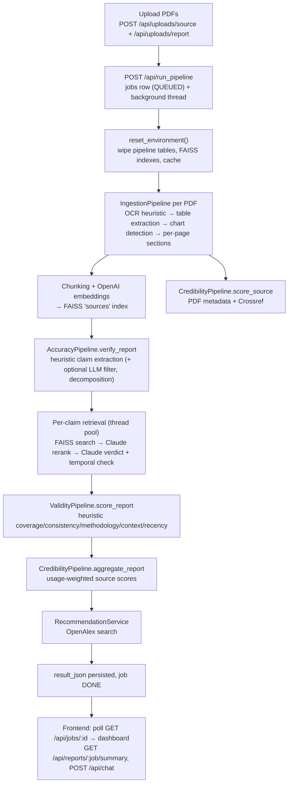

# Architecture

Author AI is a fact-checking and author-credibility scoring app: you upload one **report** PDF plus a set of **source** PDFs, and a pipeline extracts factual claims from the report, checks them against the sources with embeddings + LLM verdicts, scores the report's credibility and validity, and recommends further reading. A Flask backend (`backend/app.py`) does all the work; a React + Vite frontend (`frontend/`) drives uploads, shows the dashboard, and hosts a report-aware chat. This page describes how the pieces fit together. See [api.md](api.md) for endpoint contracts, [metrics.md](metrics.md) for scoring math, and [chat.md](chat.md) for the assistant.

## System overview



## Repository layout

```
author_-accuracy.ai/
├── README.md
├── docs/                  # this documentation set
├── backend/
│   ├── app.py             # Flask app factory + all HTTP routes
│   ├── requirements.txt
│   ├── author_ai/
│   │   ├── config.py      # env-driven Settings dataclass (cached)
│   │   ├── models.py      # dataclasses: Claim, CredibilityScore, ValidityScores, Chart…
│   │   ├── pipelines/     # ingestion, accuracy, credibility, validity, chat
│   │   ├── services/      # embeddings, FAISS, LLM helpers, OCR, tables, charts…
│   │   └── storage/       # SQLite Repository (database.py), JsonStore helper
│   ├── data/              # runtime state: accuracy.db, uploads/, indexes/, cache/
│   ├── logs/              # backend.log (single shared log file)
│   └── tests/             # pytest suite
├── frontend/
│   ├── src/
│   │   ├── App.tsx        # react-router route table
│   │   ├── api/client.ts  # fetch wrapper + typed API calls
│   │   ├── context/       # ReportDataContext (shared app state)
│   │   └── components/    # pages and panels
│   └── vite.config.ts     # dev server on port 5173
└── example_sources/       # sample PDFs for manual testing
```

## Backend

### API layer (`backend/app.py`)

`create_app()` builds the Flask app with CORS enabled and wires every route. Pipelines (`AccuracyPipeline`, `CredibilityPipeline`, `ValidityPipeline`, `ChatService`) are instantiated **once at module level** and reused across requests. Every `/api/*` route is wrapped in a `require_api_key` decorator that compares the `X-API-Key` request header to the `API_KEY` env var.

> **Gotcha:** if `API_KEY` is unset, `require_api_key` is a **no-op** — the whole API is open. Set it for anything beyond local development. See [configuration.md](configuration.md).

Error handling is centralized: `FileNotFoundError` → 404, `ValueError` → 400, anything else → 500 JSON (Werkzeug `HTTPException`s keep their own status code and description). `build_report_summary` assembles the dashboard payload from a finished job's `result_json` (accuracy = supported/total claims; credibility and validity scaled from 0–100 to 0–1; overall = plain mean of the three). It also lazily backfills `recommended_sources` into `result_json` if a pre-recommendations job is read.

### Pipelines (`backend/author_ai/pipelines/`)

**Ingestion (`ingestion.py`)** — `IngestionPipeline.ingest` takes a PDF and: runs OCR only when heuristics say text is sparse (via `services/ocr.py` and OCRmyPDF), extracts tables (Tabula or the PDFTables API), detects and parses chart images into synthetic data-point chunks, then reads text per page with PyPDF2. Each page becomes a "section" (`page-N`); section text is chunked with LangChain's `RecursiveCharacterTextSplitter` (1200 chars, 200 overlap; sliding-window fallback if LangChain is missing). The document (with a summary, table previews, and `sections_detail`), its chunks, and its charts are persisted to SQLite. Section summaries come from `SECTION_INDEXER` eagerly or lazily depending on `SECTION_SUMMARY_MODE`.

**Accuracy (`accuracy.py`)** — the coordinator. `index_source` ingests a source PDF and embeds its chunks into the shared FAISS `sources` index. `verify_report` ingests the report, extracts claims from `body_text` with regex/heuristic scoring (title/header filters, numeric-claim scorer, non-numeric verb-signal path), optionally runs a batch LLM verifiability filter (`CLAIM_QUALITY_LLM_FILTER`, uses `CLAIM_CLASSIFIER_MODEL`, default `claude-haiku-4-5`), and rule-splits compound claims. Evidence retrieval runs in a `ThreadPoolExecutor` (`PIPELINE_MAX_WORKERS`): per-source FAISS similarity search (capped by `RETRIEVAL_PER_SOURCE_CAP`), Claude rerank (`EvidenceReranker`), then a `VerdictClassifier` call over the top hits produces SUPPORTED / CONTRADICTED / NOT_FOUND with a confidence. A numeric-overlap override can rescue hits below the similarity threshold, and a temporal check downgrades SUPPORTED verdicts when claim and evidence years differ by more than `TEMPORAL_MISMATCH_TOLERANCE_YEARS`. Claims and evidence rows are persisted, and two per-report FAISS indexes are written for chat retrieval.

**Credibility (`credibility.py`)** — `score_source` collects metadata for each source (embedded PDF info + first-page heuristics + Crossref DOI lookup via `services/metadata_enrichment.py`) and sums component scores: metadata completeness, publisher authority tiers, recency, extraction confidence, and an optional manual adjustment (0–100 total). `aggregate_report` computes the report-level score as a weighted average of source scores, weighted by how many SUPPORTED claims each source backs times a confidence multiplier — sources never cited by supported claims contribute nothing.

**Validity (`validity.py`)** — `score_report` scores the report itself with pure heuristics (no LLM): topic coverage against `VALIDITY_TOPICS`, internal numeric consistency, methodology-keyword presence, geographic context terms, and source recency, combined via `VALIDITY_WEIGHTS`. Results and diagnostics (missing topics, methodology gaps) are upserted into `validity_scores`.

> **Quirk:** `verify_report` and `score_report` each call `IngestionPipeline.ingest` on the report, so the report PDF is fully ingested **twice** per pipeline run.

**Chat (`chat.py`)** — `ChatService.respond` answers questions about the latest verified report. It detects intent (small talk vs. report), resolves explicit claim references ("claim 3", "all claims"), embeds the question and searches the per-report claim and evidence FAISS indexes, then assembles a context prompt (claim findings, evidence snippets, metric diagnostics, trimmed history) for `LLM_CHAT_MODEL` (default `claude-sonnet-4-6`). Three modes — evidence / guidance / creative — swap the system prompt and relax retrieval thresholds; without `ANTHROPIC_API_KEY` it degrades to a deterministic composed answer. Details in [chat.md](chat.md).

### Services (`backend/author_ai/services/`)

| Group | Module | Role |
| --- | --- | --- |
| Retrieval stack | `embedding.py` | OpenAI embeddings (`EMBEDDING_MODEL`, default `text-embedding-3-large`); deterministic local fallback when `OPENAI_API_KEY` is unset |
| Retrieval stack | `vector_store.py` | `VectorStore`: LangChain FAISS wrapper (L2-normalized, persisted per directory) with a raw-FAISS fallback implementation |
| Retrieval stack | `reranker.py` | `EvidenceReranker`: Claude (`RERANK_MODEL`, default `claude-haiku-4-5`) re-scores candidate snippets; falls back to similarity order |
| Retrieval stack | `verdict_classifier.py` | `VerdictClassifier`: Claude-based SUPPORTED/CONTRADICTED/NOT_FOUND labeling with a numeric-comparison heuristic fallback |
| Retrieval stack | `section_indexer.py` | `SECTION_INDEXER`: optional LlamaIndex + OpenAI section summarizer for parent-section context |
| LLM / external | `summarizer.py` | Document summaries via Anthropic, extractive fallback otherwise |
| LLM / external | `recommendations.py` | `RecommendationService`: queries the OpenAlex API and ranks results with embeddings + summaries |
| PDF processing | `ocr.py` | Heuristics for "does this PDF need OCR", shells out to OCRmyPDF |
| PDF processing | `table_extraction.py` | Table extraction via the Tabula JAR (subprocess) or PDFTables API |
| PDF processing | `charts.py`, `chart_parser.py` | Detect chart images in PDFs and parse them (cv2/pytesseract, stubbed if absent) into data-point chunks |
| PDF processing | `metadata_enrichment.py` | Embedded PDF metadata + header heuristics + Crossref DOI lookup for credibility |
| Misc | `environment.py` | `reset_environment()`: wipes pipeline tables, FAISS index dirs, and cache before each run |
| Misc | `file_store.py` | Saves uploads to `data/uploads/<upload_id>/<filename>` |
| Misc | `logger.py` | Named per-module loggers that all write to a single `backend.log` under `LOG_DIR` |

### Storage (`backend/author_ai/storage/database.py`)

`Repository` is a thin helper over SQLite at `backend/data/accuracy.db` (`SQLITE_PATH`). Connections are **thread-local** (one per worker thread), rows are `sqlite3.Row`, and most structured fields are JSON-encoded TEXT columns stamped with a `schema_version`. `init_db()` creates all tables idempotently and applies additive `ALTER TABLE` migrations (e.g. `claims.processing_mode`, `jobs.progress_json`, chart columns on `chunks`).

| Table | Contents |
| --- | --- |
| `documents` | One row per ingested PDF (`doc_type` REPORT/SOURCE, metadata JSON incl. `sections_detail` and summaries, full `body_text`) |
| `chunks` | Text chunks and chart data points (`chunk_type`, `chart_id`, `x_value`/`y_value`/`series_name`) |
| `charts` | Detected chart figures (page, bbox, chart type, raw parse JSON) |
| `claims` | Extracted claims with verdict, confidence, band, explanation, metadata |
| `claim_evidence` | Retrieval hits per claim; best hit carries the claim's verdict, others are `ALTERNATIVE` |
| `credibility_scores` | Per-source score + component breakdown |
| `validity_scores` | Per-report validity sub-scores + diagnostics JSON |
| `chat_logs` | Chat turns keyed by session and report |
| `uploads` | Uploaded-file registry (survives environment resets) |
| `jobs` | Pipeline runs: status, `source_ids`, `result_json`, `progress_json`, error message (survives resets) |

FAISS indexes live under `backend/data/indexes/` (`FAISS_INDEX_DIR`), each as a directory of `index.faiss` + `index.pkl`:

- `indexes/sources/` — the shared source-chunk index used for claim verification (`VectorStore("sources")`).
- `indexes/claims/<report_id>/` — per-report claim index for chat (`CLAIM_VECTOR_PATH`).
- `indexes/sources/<report_id>/` — per-report evidence-snippet index for chat (`SOURCE_VECTOR_PATH`).

> **Quirk:** the per-report evidence indexes are **nested inside** the shared `indexes/sources/` directory, so a `<report_id>/` folder sits next to `index.faiss`. It works because each index is loaded by its own directory path, but it looks odd on disk.

> **Design note — last run wins:** every `/api/run_pipeline` call runs `reset_environment()`, which deletes all rows from `documents`, `chunks`, `claims`, `claim_evidence`, `credibility_scores`, `validity_scores`, and `chat_logs`, and removes the FAISS index and cache directories. Only `uploads`, `jobs` (with their frozen `result_json`), the files on disk — and, because `charts` is missing from the wipe list, stale `charts` rows — survive. The app is a single-report system: live queries (claims, source details, chat) always describe the most recent run.

## Async job lifecycle

`POST /api/run_pipeline` inserts a `jobs` row with status `QUEUED`, then validates the report/source upload IDs (a validation failure returns 400 but leaves that row stuck in `QUEUED`), spawns a **daemon thread**, and returns `{job_id, status}` immediately. The thread moves the job to `RUNNING`, then pushes named progress steps into `progress_json` via `Repository.push_job_progress` — each entry is `{step, label, status, ts}` with `status` in `running` / `done` / `failed`:

| Step | Meaning |
| --- | --- |
| `indexing` | Ingest + embed each source, score its credibility |
| `verifying` | Extract claims from the report and retrieve/classify evidence |
| `validity` | Heuristic validity scoring |
| `credibility` | Usage-weighted credibility aggregation |
| `recommendations` | OpenAlex recommendation search |

On success the job gets `status=DONE` and a `result_json` containing `claims`, `report_id`, `validity`, `credibility`, and `recommended_sources`. On failure the last `running` step is flipped to `failed` and the job gets `status=FAILED` plus `error_message`. Clients poll `GET /api/jobs/<job_id>`; the frontend's `UploadPage` polls every 2 seconds and renders `progress_json` as a checklist.

> **Gotcha:** jobs run inside the Flask process itself — there is no queue or worker. If the server restarts mid-run, the job stays `RUNNING` forever and is simply lost.

## Frontend (`frontend/`)

React 18 + TypeScript + Vite (dev server on port 5173), routing via `react-router-dom`. Routes are declared in `src/App.tsx`:

| Route | Component | Purpose |
| --- | --- | --- |
| `/` | `UploadPage` | Upload sources + report, start the pipeline, watch progress |
| `/dashboard` | `ReportDashboard` | Scores, claims, sources, recommendations, chat |
| `/dashboard/sources/:sourceId` | `SourceDetail` | Per-source credibility breakdown, claims, PDF viewer |
| `/dashboard/report` | `ReportDetail` | Full report PDF alongside summary and scores |
| `/dashboard/recommendations/:sourceIndex` | `RecommendedSourceDetail` | Detail view of one OpenAlex recommendation |

**`ReportDataContext`** (`src/context/ReportDataContext.tsx`) is the app's shared state: the uploaded source list and report document (hydrated from `GET /api/uploads` on mount), the cached `ReportSummaryResponse`, per-job chat history, and job status. `refreshJobStatus` re-fetches a job and stores `active_job_id` in `localStorage` once it is `DONE`, so the dashboard can find the latest report after a page reload.

| Component | Role |
| --- | --- |
| `UploadPage` | Drag/drop uploads, `POST /api/run_pipeline`, 2-second job polling with step checklist |
| `ReportDashboard` | Composes the dashboard from `GET /api/reports/…/summary` and paginated claims |
| `SummaryPanel` | Report summary text, claim stats, top sources |
| `RatingPanel` | SVG score rings for overall / accuracy / credibility / validity |
| `ClaimsPanel` | Paginated claim list with verdict colouring and evidence snippets |
| `ClaimsWorkspace` | Expanded claim explorer with verdict filters next to the report PDF |
| `InternalSourcesPanel` | Uploaded source list with add/remove |
| `AnalyticsPanel` | Recommended-sources overview linking to detail pages |
| `RecommendedSourcesPanel` | Simple pill list of recommended source names |
| `ChatPanel` | Chat UI with mode selector, markdown rendering (react-markdown + remark-gfm) |
| `SourceDetail` / `ReportDetail` / `RecommendedSourceDetail` | The three detail pages listed in the routes table |

**Talking to the API** — `src/api/client.ts` exports `apiFetch`, which prefixes `VITE_API_BASE_URL` (default `http://localhost:5001`), sets `Content-Type: application/json` for non-FormData bodies, and attaches `X-API-Key` from `VITE_API_KEY` when present. All typed helper functions (`getReportSummary`, `runPipelineWithUploads`, `sendChat`, …) go through it. PDF viewing is a special case: because an `<iframe>` cannot send headers, `ReportDetail`, `SourceDetail`, and `ClaimsWorkspace` fetch `/api/uploads/<id>/file` themselves with the API key, turn the response into a **blob object URL**, and point the iframe at that.

## Related docs

- [README.md](../README.md) — quick start
- [api.md](api.md) — full endpoint reference
- [metrics.md](metrics.md) — accuracy / credibility / validity formulas
- [chat.md](chat.md) — chat modes and retrieval
- [development.md](development.md) — running and testing locally
- [configuration.md](configuration.md) — every env var
- [history.md](history.md) — how the project evolved and what the other branches contain
