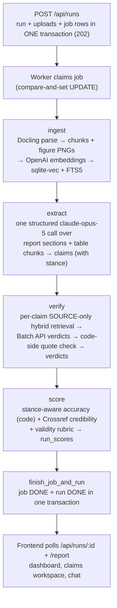

# Architecture

Author AI v2 fact-checks a **report** PDF against a set of **source** PDFs. A FastAPI backend (`backend/authorai/`) ingests the PDFs, extracts the report's checkable claims, verifies each claim against the sources, and scores the report three ways (accuracy, credibility, validity). A React + Vite frontend (`frontend/`) drives uploads, shows per-run dashboards, and hosts a grounded chat. See [metrics.md](metrics.md) for what the numbers mean and [development.md](development.md) for running it.

## Design principles

- **The LLM makes language judgments; code does the math and bookkeeping.** Every LLM judgment goes through structured outputs (`messages.parse()`), and judgments that assert something (verdicts, validity assessments) must cite a verbatim quote that *code* then verifies against the text actually shown to the model.
- **Every table is run-scoped.** Each pipeline table carries a `run_id`; runs never overwrite each other and there is no reset step, ever. (v1 wiped the world on every run.)
- **Failures are loud, never silent fallbacks.** No API key ⇒ the process refuses to start. A missing figure image ⇒ the judge call raises instead of degrading to text. Malformed config weights ⇒ error, not defaults. Partial batch results ⇒ nothing is stored.
- **Accuracy is reported three ways** — supported / contradicted / unverifiable — and the headline number never counts "we couldn't check it" as "wrong".

## Pipeline

One upload creates one run, one job, and four resumable steps executed by a single background worker:

Each step is recorded in the job's `progress` JSON (`{step, label, status, ts}`, upserted by step name). A restart re-queues any `RUNNING` job and resumes from its first incomplete step — see [Jobs](#jobs-jobspy).

## Backend modules (`backend/authorai/`)

| Module | Role |
| --- | --- |
| `db.py` | SQLite schema, migrations, and all repository functions |
| `ingest.py` | Docling PDF parsing → sections/tables/figures → chunks + embeddings |
| `chunking.py` | Plain-code paragraph packing (1200 chars, 200 overlap) |
| `embeddings.py` | OpenAI embeddings (`text-embedding-3-large`, dim 3072); `FakeEmbedder` for tests |
| `search.py` | Hybrid search: sqlite-vec KNN + FTS5 BM25, fused with RRF |
| `claims.py` | Claim extraction (structured LLM call, stance-aware) |
| `verification.py` | Evidence retrieval, verdict judging, code-side quote verification |
| `credibility.py` | Source metadata extraction, Crossref verification tiers, credibility scoring |
| `scoring.py` | Stance-aware accuracy (pure code), validity rubric, `score_run` orchestration |
| `jobs.py` | Jobs worker: one thread, resumable steps, startup recovery |
| `api.py` | Authenticated HTTP API + pure-ASGI auth/size middleware |
| `chat.py` | Grounded chat over a DONE run (prompt-cached context) |
| `llm.py` | The one Anthropic client — all LLM traffic, sync + batch + vision + chat |
| `evals.py` | Golden-set scorers (extraction recall/precision, verdict accuracy, stance) |
| `config.py` | Pydantic settings from env / `backend/.env` (prefix `AUTHORAI_`) |
| `cli.py` | `python -m authorai.cli ingest/extract/eval-extract/verify/eval-verdict/score/search` |
| `main.py` | App factory: fail-closed startup, worker lifecycle, CORS |

## Storage (`db.py`)

One SQLite file (`AUTHORAI_DB_PATH`, default `data/authorai.db`) holds everything: relational tables, the FTS5 keyword index, and the sqlite-vec vector index. Connections run WAL with `busy_timeout=5000` (set *before* the WAL switch so racing openers wait instead of throwing `SQLITE_BUSY`) and `foreign_keys=ON`.

**Migrations** run at connect time via `PRAGMA user_version`; `SCHEMA_VERSION` is currently **9**. Each migration is an `if version < N:` block whose DDL, data moves, and version bump execute in one `BEGIN…COMMIT` script, so an interruption can never leave a half-created schema. Two loud guards at open:

- A database with `user_version > SCHEMA_VERSION` (written by a newer build) **refuses to open** — an old checkout writing through a schema it doesn't understand would corrupt silently.
- A database created with a different `embedding_dim` than configured refuses to open — mixed dimensions would corrupt every similarity search.

| Table | Contents |
| --- | --- |
| `meta` | Key/value; stores the database's `embedding_dim` |
| `runs` | `id, created_at, status (CREATED/RUNNING/DONE/FAILED), error` |
| `uploads` | Stored PDF files: kind, original file name, server-side path |
| `documents` | One row per ingested PDF: `run_id`, kind (`SOURCE`/`REPORT`), title, metadata JSON (report sections) |
| `chunks` | Retrieval units: `run_id`, `doc_id`, page, section, kind (`text`/`table`/`figure`), text, `figure_id` |
| `chunks_fts` | FTS5 index over chunk text (external-content table, trigger-synced) |
| `chunks_vec` | sqlite-vec `vec0` index: `run_id` **and** `doc_kind` are PARTITION KEYs |
| `figures` | Extracted figure PNGs: image path, caption, LLM description |
| `claims` | Extracted claims: text, value, unit, year, subject, **`stance`** (`asserted`/`disavowed`), `extraction_prompt_hash` |
| `verdicts` | One per claim (`claim_id UNIQUE`, `ON DELETE CASCADE`): verdict, `raw_verdict`, quote, `quote_verified`, `quoted_chunk_id`, evidence chunk ids, `year_flag`, rationale, model, `prompt_hash` |
| `run_scores` | The run's three scores as JSON (accuracy, credibility, validity) |
| `source_credibility` | Per-source metadata, component scores, total, tier |
| `jobs` | Pipeline jobs: status, payload (upload ids), progress JSON, error |

Index-invariants enforced in SQL:

- **Chunk text is immutable** — a `BEFORE UPDATE OF text` trigger aborts, because an in-place edit would desync the stored embedding. Delete and re-add instead.
- FTS5 stays in sync via `AFTER INSERT` / `AFTER DELETE` triggers; the delete trigger also removes the row's vector from `chunks_vec`.
- Embeddings are L2-normalized on write, so vector distance ordering equals cosine ordering.

## Hybrid search (`search.py`)

Vector search is good at paraphrase and bad at exact numbers; keyword search is the reverse. Both channels fetch up to `max(k, 20)` candidates, then Reciprocal Rank Fusion (`score = Σ 1/(60 + rank)`, rank 1-based) merges them so a chunk found by both outranks single-channel hits.

- **Vector channel**: sqlite-vec KNN, scoped by the `run_id` (and optionally `doc_kind`) PARTITION KEYs — index-native filtering, no over-fetch, no post-filter.
- **Keyword channel**: FTS5/BM25; each query token is quoted (user text can't break FTS5 syntax) and tokens are **OR**-joined — claim-length queries under implicit AND would return nothing.

Every query is scoped to one run via SQL. Verification passes `doc_kind="SOURCE"` so a report can never be its own evidence.

## Ingestion (`ingest.py`, `chunking.py`)

`parse_pdf` is the only function that touches Docling (digital PDFs only — `do_ocr=False` is a deliberate flag, not a gap; `images_scale=2.0`, picture images generated). It yields sections, tables (exported to Markdown + caption), and figures (PIL images + caption). Downstream:

- **Text** chunks: paragraphs packed greedily to 1200 chars with 200-char overlap; a chunk never splices non-adjacent passages (**document-order invariant** — chunk text is quoted as evidence downstream).
- **Table** chunks: caption + Markdown, capped at 4000 chars.
- **Figure** chunks: caption plus an LLM-written description (`claude-haiku-4-5`), baked into the chunk text *before* embedding — chunk text is immutable, so this is the only moment it can happen. The PNG is saved under `figures_dir/<run_id>/<doc_id>/`.

All failure-prone external work (parsing, figure descriptions, the embedding call) happens **before** any database or filesystem write, so a failed ingest leaves no half-ingested document. An empty parse raises instead of indexing an empty document.

## LLM layer (`llm.py`, `config.py`)

All Anthropic traffic goes through one client. It refuses to construct without `ANTHROPIC_API_KEY`, raises when a call yields no usable output, and logs token usage (including cache read/write) per call.

| Path | Details |
| --- | --- |
| `parse()` | `messages.parse()` structured outputs; `max_tokens=16000` (Opus thinking shares the budget; 16k is the ceiling under the SDK's non-streaming timeout); optional image blocks |
| `parse_batch()` | Batch API at `max_tokens=32000`; **all-or-nothing** — a failed item gets one logged sync retry, and anything still failing raises with nothing stored (partial results would silently change score denominators). The batch id is logged at creation so an interrupt never orphans a paid batch |
| `describe_image()` | Figure captions (vision) |
| `chat()` | System sent as a list of blocks so the static per-run context carries `cache_control` (prompt caching); thinking disabled |

`prompt_fingerprint()` produces the canonical hash of a **prompt contract**: the system prompt, a prompt *rendered* from frozen synthetic inputs (so builder formatting changes move the hash), and the output model's field descriptions (which are prompt text under structured outputs). Claims are stamped with `EXTRACTION_PROMPT_HASH` and verdicts with `VERDICT_PROMPT_HASH:k=N`; the eval commands and `score_run` refuse rows whose stamp differs from the current prompt (stale-guard; `--allow-stale` overrides).

Model assignment (all configurable):

| Task | Model |
| --- | --- |
| Claim extraction | `claude-opus-5` |
| Verdicts | `claude-opus-5` |
| Validity rubric | `claude-opus-5` |
| Figure captions | `claude-haiku-4-5` |
| Source metadata | `claude-haiku-4-5` |
| Chat | `claude-sonnet-5` |
| Embeddings | OpenAI `text-embedding-3-large` (dim 3072) |

## Claim extraction (`claims.py`)

One structured call over the report's prose sections **and its table chunks** (tables are chunks, not section text — without passing them explicitly, the report's most checkable figures would be invisible). Each `ExtractedClaim` carries verbatim `text`, `subject`, `value`, `unit`, `year`, `page`, and **`stance`**:

- When a report presents a claim as reported speech ("some analyses claim X"), the checkable claim is **X itself** — extraction stores the embedded assertion, dropping the reporting frame and any editorial verdict.
- `stance` is `disavowed` only when the report attaches an **explicit falsity marker** ("an event that never occurred", "a fabricated figure"). Neutral relaying stays `asserted`.

Re-extraction replaces a document's claims atomically; the `verdicts.claim_id` FK cascades, so stale verdicts go with them.

## Verification (`verification.py`)

Per claim, the LLM makes exactly one judgment; everything else is code:

1. **Retrieval** — SOURCE-only hybrid search (`doc_kind="SOURCE"` partition), 8 evidence chunks per claim (`-k` overrides), one batched embedding call for all queries. A claim with no retrieved evidence gets an UNVERIFIABLE bookkeeping row (logged, not judged).
2. **Judging** — structured `Verdict` (verdict, verbatim quote, 1-based evidence index, rationale) on `claude-opus-5`, normally via the Batch API. When evidence includes figure chunks, up to 2 figure PNGs are attached so the judge sees the chart; a missing PNG **raises** rather than silently judging text-only.
3. **Code-side quote check** — the quote must appear (case-folded, PDF typography normalized) in the cited excerpt, or failing that in *any* excerpt shown (right quote, wrong index is an indexing slip, not fabrication). Quotes under 10 normalized chars are rejected as too weak to ground anything.
4. **Downgrade rule** — a SUPPORTED or CONTRADICTED verdict whose quote fails the check is downgraded to **UNVERIFIABLE**; the model's original answer is preserved in `raw_verdict` so the downgrade rate stays measurable.
5. **Year flag** (informational only) — `year_flag=1` when the claim's year is absent from the quoted chunk.

Verdicts are stored with `replace=True` semantics and stamped with the judge's prompt hash + evidence k.

## Scoring (`scoring.py`, `credibility.py`)

`score_run` computes everything **before** persisting anything (a mid-way failure leaves the prior score set intact), refuses stale verdicts by default, then writes `source_credibility` and `run_scores` adjacent at the end.

- **Accuracy** — pure arithmetic; stance-aware report-position agreement. See [metrics.md](metrics.md).
- **Credibility** — per source: Haiku extracts bibliographic metadata from the opening chunks; Crossref verification assigns a tier (`VERIFIED_DOI` / `VERIFIED_TITLE` / `METADATA_ONLY` / `NONE`); code sums component points (completeness, word-boundary publisher authority, recency, verification — **no floors**). Aggregated as a usage-weighted mean, where usage counts quote-verified verdicts citing each source (SUPPORTED **and** CONTRADICTED — a contradicting source is doing its job). Crossref 404 is an answer; 429/5xx retries then **raises** (a throttled Crossref must not silently downgrade tiers).
- **Validity** — one structured rubric call (coverage, consistency, methodology, context, each 0–100 with justification + illustrative quote that code checks against the report text) plus a code-side recency component from real source publication years. Weights come from config, parsed loudly; a component with no score is excluded and weights renormalize.

## Jobs (`jobs.py`)

- **One** persistent worker thread claims queued jobs via a compare-and-set `UPDATE … RETURNING`. The worker survives anything a job lets escape (a dead worker would leave every job QUEUED while `/health` reports ok).
- The job `payload` carries its work order (upload ids), so recovery never guesses what a run should contain.
- **Startup recovery**: `RUNNING` jobs found at startup are re-queued and resumed from the first incomplete step. Steps make that safe: extract/verify/score are replace-semantics idempotent, and ingest reconciles per upload — chunks present ⇒ done; a document with zero chunks is a torn ingest and is deleted (rows + figure PNGs) and re-ingested; nothing ⇒ ingest fresh.
- **Atomic terminal state**: `finish_job_and_run` writes job and run terminal status in one transaction — two separate writes would leave a crash window where job=DONE, run=RUNNING forever, invisible to recovery. The DONE write sits *outside* the failure handler, so a bookkeeping failure can never rewrite a successful run as FAILED.
- **Single process** is a hard constraint: startup recovery re-queues every RUNNING job unconditionally, which is only correct when no other process can be mid-job. Never run `uvicorn --workers N>1` against one database.

## HTTP API (`api.py`, `main.py`)

Startup is **fail-closed**: no `AUTHORAI_API_KEY` ⇒ the app refuses to start (v1 silently served everything openly).

Auth and the request-size cap live in a **pure-ASGI middleware** that runs before the body is parsed — a FastAPI route dependency resolves only *after* the whole multipart body is read, so per-route auth cannot stop an unauthenticated upload DoS. The middleware guards the whole `/api` prefix (a new endpoint cannot forget it), compares keys on raw bytes in constant time, and rejects oversized `Content-Length` with 413 before reading anything. CORS is outermost so its headers land on the guard's 401s; credentials mode is off.

| Endpoint | Purpose |
| --- | --- |
| `GET /health` | Liveness (unauthenticated) |
| `POST /api/runs` → 202 | Upload report + sources; every file validated (extension, size, `%PDF-` magic) before any write; run + uploads + job committed in one transaction; files cleaned up on failure |
| `GET /api/runs` | Run history |
| `GET /api/runs/{id}` | Run + latest job (progress feed) |
| `GET /api/jobs/{id}` | Job by id |
| `GET /api/runs/{id}/report` | Full report payload (claims + verdicts + evidence sources, scores, per-source credibility) read in one snapshot transaction |
| `GET /api/runs/{id}/documents/{doc_id}/file` | Stream a run's stored PDF; scoped by `(run_id, doc_id)`, path resolve-checked inside `uploads_dir` |
| `POST /api/runs/{id}/chat` | Grounded Q&A over a DONE run; the static per-run context is a `cache_control` system block, so repeat turns hit the prompt cache |

## Frontend (`frontend/`)

React 18 + TypeScript + Vite 5, `react-router-dom` 6, **TanStack Query v5** as the data layer (`src/api/{types,v2,queries}.ts`). All requests carry `X-API-Key` from `VITE_API_KEY`; base URL from `VITE_API_BASE_URL` (default `http://localhost:8000`).

| Route | Component | Purpose |
| --- | --- | --- |
| `/` | `UploadPage` | Single-request upload (report + sources) → navigate to the run |
| `/runs` | `HistoryPage` | Run history |
| `/runs/:runId` | `ReportDashboard` | Live job progress feed → full report on DONE; `RatingPanel` (accuracy / coverage / credibility / validity rings — **no composite overall**); chat |
| `/runs/:runId/report` | `ReportDetail` | Report PDF viewer |
| `/runs/:runId/sources/:sourceId` | `SourceDetail` | Per-source credibility breakdown + PDF |
| `/runs/:runId/workspace` | `ClaimsWorkspace` | Claim ↔ report-page ↔ source-page navigation, `#page` deep links, side-by-side PDF panes |
| `/compare` | `ComparePage` | Two runs' scores + stats with per-metric deltas |

Mechanics worth knowing:

- Run/report queries poll every 1.5 s and **stop on terminal status** (`DONE`/`FAILED`) or query error — a finished run is never refetched forever.
- PDFs are fetched as **authenticated blobs** (`usePdfBlob`): an iframe can't send the API key header, so the client fetches the file itself, hands the iframe an object URL, and revokes the previous URL on change. The key never appears in any URL.
- Tests: Vitest 3.x + React Testing Library (`npm run test`, also in CI).

## Evals (`evals.py`, `backend/evals/`)

Two audited label sets (dev golden, 37 records; holdout, 27) with recorded baselines as JSON. Scorers compare stored claims/verdicts against the labels with one-to-one pairing. Full details, discipline, and the recorded numbers: [metrics.md](metrics.md); how to run them: [development.md](development.md).
